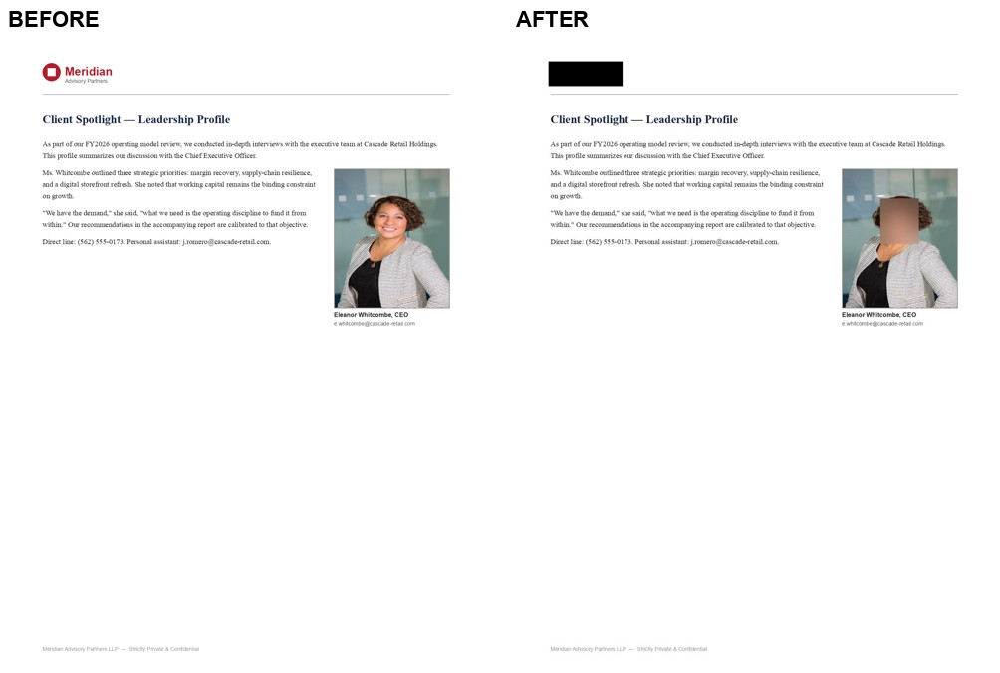

# Text & Image Masking

A redaction pipeline that automatically finds and masks **sensitive content
embedded in images and documents** — company **logos**, human **faces**, and
sensitive **text / PII** — and writes back a redacted copy plus a non-destructive
debug overlay showing exactly what was found and where.

It's built for consulting / advisory / audit / tax-style material (engagement
letters, financial statements, slide decks, business cards, scanned PDFs) where a
single page often mixes all three: a client logo in the header, headshots in a
team slide, and names / emails / account numbers in the body.

## What it looks like

Each image is run through the pipeline and produces a redacted copy. Below,
**before** is the original and **after** is what the pipeline emits.

**Advisory report — company logo + embedded headshot.** The "Meridian" logo is
blacked out and the executive's face is Gaussian-blurred; the body text is left
for the text phase.



**Team slide — 4 faces blurred.** Every headshot is detected and blurred while
the layout, names, and roles are preserved.


**Business card — logo masked.**


**Financial statement — logo masked.**


> Regenerate these (and overlays for the whole sample set) by running the
> pipeline over `test_set/` — see [Running](#running).

## How it works

Three detectors run over each image, each feeding a shared coordinate stage that
rescales, clips, pads, merges, and de-duplicates boxes before anything is drawn
or masked:

```text
                 ┌──────────────── one image ────────────────┐
                 ▼                  ▼                          ▼
        Grounding DINO          YuNet                 ai_parse_document
        (graphical logos)       (faces)               (text / wordmarks / PII)
                 │                  │                          │
          CLIP gate:          pad ~15%               regex PII pre-filter
          drop icons,                                + Claude classifier
          keep Databricks                            (pii_only | all_text)
                 └──────────┬───────┴───────────┬──────────────┘
                            ▼                   ▼
                   shared box stage      debug overlay (non-destructive)
                   (rescale·clip·pad·            │
                    merge·NMS)                    ▼
                            ▼              apply_masks
                            └────────────► faces→blur, logos/text→black
                                                  → *_masked.*
```

- **Logos** — [Grounding DINO](https://huggingface.co/IDEA-Research/grounding-dino-base)
  open-vocabulary detection with pixel-accurate `(H, W)` post-processing, then a
  **CLIP verification gate** that drops decorative icons / photos / charts so the
  pipeline masks real brand marks, not infographics. An **allowlist** (CLIP
  reference-image similarity against crops in `refs/`) can *keep* a chosen brand
  (e.g. your own logo) while masking every third-party mark.
- **Faces** — OpenCV **YuNet** (bundled DNN backend, tiny ONNX in `models/`), then
  **Gaussian blur** rather than a hard box — less destructive, still de-identifying.
- **Text / PII** — Databricks **`ai_parse_document`** localizes text elements
  (including wordmark logos like Gartner / Forrester that the graphical detector
  ignores), then a **regex PII pre-filter + Claude classifier** decides what to
  mask (`pii_only` vs `all_text`) so body copy isn't blindly blacked out.

Masks: **faces → blur, logos & text → black box.** Every run also emits a colored,
labelled **debug overlay** so you can tell detection errors from localization
errors at a glance.

## Layout

```text
text_and_image_masking/
├── masking_pipeline.ipynb   # entry point — run, visualise, evaluate
├── pipeline/
│   ├── boxes.py             # Detection type + ALL coordinate handling
│   ├── detectors.py         # LogoDetector (GDINO), FaceDetector (YuNet), TextDetector (DBNet)
│   ├── verify.py            # CLIP gate: icon filter (text-prompt) + brand allowlist (image-sim)
│   ├── text_pii.py          # ai_parse_document text + regex/Claude PII filter
│   ├── masking.py           # apply_masks: black box / Gaussian blur per source
│   ├── overlay.py           # debug overlay renderer
│   ├── tracking.py          # MLflow instrumentation (dry-run if no MLflow)
│   └── run.py               # MaskingPipeline orchestrator + PipelineConfig
├── eval/
│   ├── score.py             # auto-propose GT + IoU precision/recall/coverage
│   ├── track_masking.py     # runnable MLflow workflow (single run or threshold sweep)
│   └── ground_truth.json    # auto-proposed scaffold — CORRECT BY HAND before trusting scores
├── app/                     # torch-free FastAPI Databricks App (vanilla-JS UI, SSE streaming)
├── deploy/                  # GPU Model Serving endpoint (vision) deploy scripts
├── refs/                    # reference logo crops for the brand allowlist
├── models/                  # YuNet ONNX (+ optional DBNet) — see requirements.txt
├── test_set/                # sample input images + build scripts + manifest
├── sample_data/             # signed-document samples (signature handling)
├── docs/img/                # before/after showcase composites (this README)
├── EVALUATION.md            # detection/localization failure analysis
├── PLAN.md                  # design rationale
├── NEXT_STEPS.md            # roadmap: specialized models (signatures, tables, financial PII)
└── requirements.txt

# outputs/ (*_overlay.jpg + *_masked.jpg per image) are generated at run time.
```

## Running

```python
from pipeline.run import MaskingPipeline, PipelineConfig

pipe = MaskingPipeline(PipelineConfig(do_logos=True, do_faces=True, do_text=False))
dets, overlay, masked = pipe.run("test_set/doc_report_with_photo.png")
overlay.save("debug.jpg")   # what was found + where (colored, labelled)
masked.save("out.jpg")      # the redacted image
```

- **Logos + faces run fully locally** (CPU / Apple MPS / GPU; auto-detected). The
  Grounding DINO + CLIP weights auto-download from Hugging Face on first run; the
  YuNet ONNX ships in `models/`.
- **Text phase** needs a Databricks serverless session for `ai_parse_document`.
  Set `do_text=True` and pass a `spark` session + `claude_endpoint` (see the
  notebook). It catches wordmark logos and PII the graphical detector leaves alone.

### Tuning the brand allowlist

Drop reference crops of a logo you want to **keep** (white-on-dark, mark-only,
on-white, …) into `refs/`. The allowlist keeps any detected logo whose CLIP
image-embedding cosine similarity to *any* reference exceeds `databricks_min_sim`
(default 0.80). Reference-image similarity is used instead of text prompts because
zero-shot "is this the X logo?" wrongly tagged a serif title and a car emblem.

## Tracking performance (MLflow)

`pipeline/tracking.py` captures each evaluation as an MLflow run — **params**
(config, model ids, git sha), **metrics** (per-category precision / recall /
coverage @ IoU + workflow latency, mask-area fraction, detection counts, mean
confidence), and **artifacts** (overlays, masked images, scored report). One
config = one run, so threshold sweeps and model swaps compare directly in the UI.

```bash
# single run over the sample set
python eval/track_masking.py --experiment /Shared/image-masking
# logo-threshold sweep (one run per threshold)
python eval/track_masking.py --sweep --experiment /Shared/image-masking
# include the ai_parse_document text phase
python eval/track_masking.py --do-text --experiment /Shared/image-masking
```

MLflow is native on Databricks; with no MLflow installed it runs in **dry-run**
mode (metrics computed and printed, not logged), so the metric logic is testable
offline. The notebook has equivalent cells (`evaluate_and_log` / `sweep_and_log`).

## Known limitations

- **Text phase requires Databricks** — `ai_parse_document` is a platform function;
  the logo + face phases are fully local. Run with `do_text=True` for full coverage
  (wordmark logos and PII depend on it).
- **`ground_truth.json` is auto-proposed** — correct it before trusting eval
  numbers (scores against an uncorrected scaffold are meaningless by construction).
- **Thresholds** (`logo_box_threshold`, `databricks_min_sim`, face score) are
  reasonable defaults; sweep them against the corrected eval set per image type.

See [`EVALUATION.md`](./EVALUATION.md) for the detection/localization analysis,
[`PLAN.md`](./PLAN.md) for design rationale, and [`NEXT_STEPS.md`](./NEXT_STEPS.md)
for the roadmap (signatures, table cells, structured financial PII).
